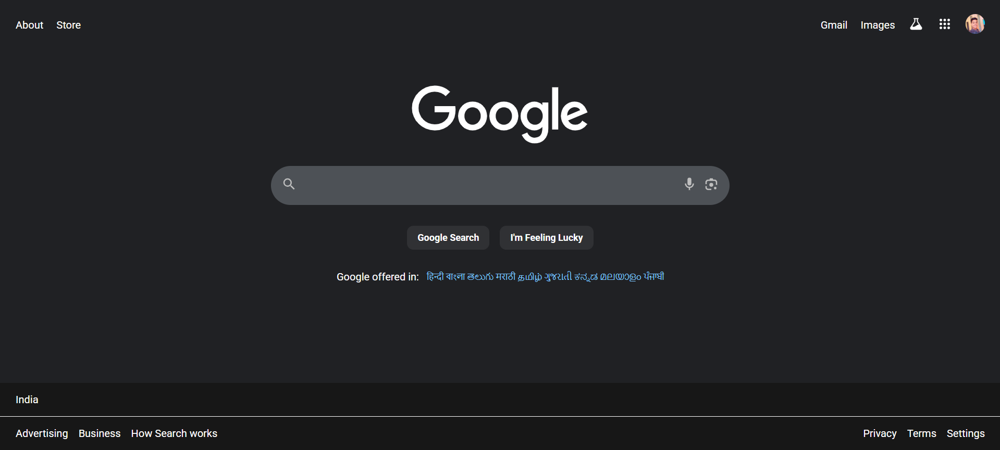

# 🌐 Google Landing Page Clone

  

A simple **Google Landing Page Clone** built using **HTML** and **CSS**.  
This project replicates the clean and minimal design of Google's homepage, focusing on layout, alignment, and styling with pure CSS.

---

## 📸 Screenshot
  

---

## 🚀 Features
- Clean and minimal UI using pure HTML & CSS  
- Search bar with hover/focus effects  
- Navigation links styled to look like Google's top bar  

---

## 🛠️ Tech Stack
- **HTML5** – for structure  
- **CSS3** – for styling and layout  

---

## 📂 Project Structure
```bash
├── index.html       # Main HTML file
├── style.css        # Styling file
├── profile.jpg      # Profile picture
├── thumbnail.png    # Project thumbnail
└── screenshot.png   # Project screenshot
